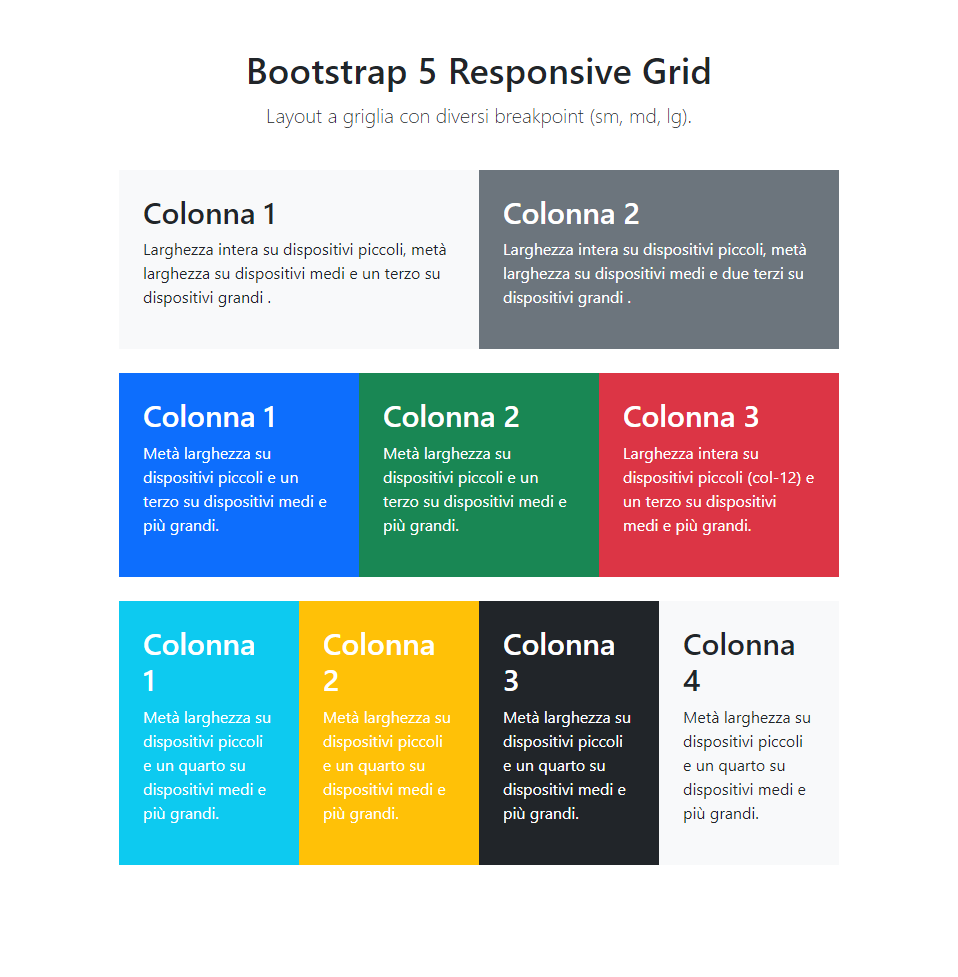
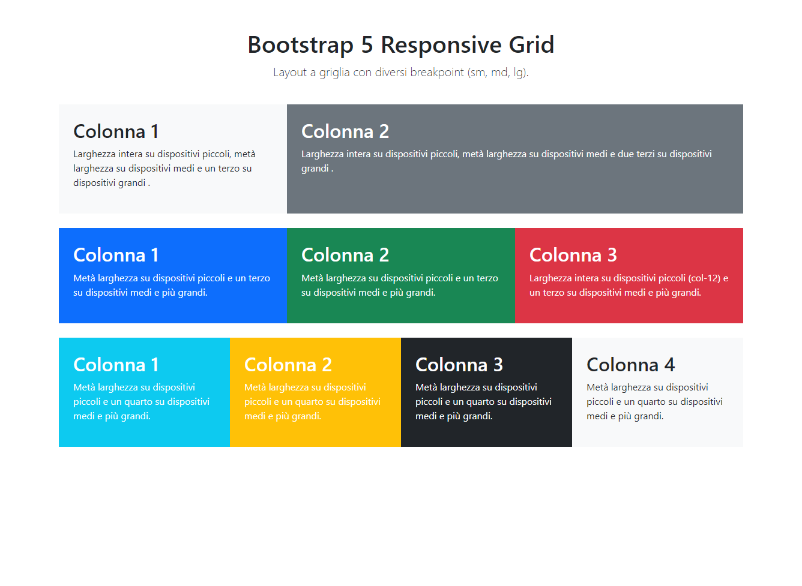

# HTML / CSS BOOTSTRAP LAYOUT

This project is the sixth exercise of the Web Development Master Course. It focuses on mastering <b>Bootstrap 5 </b> by implementing a standard grid layout using the framework's official documentation and utility classes.

## TASK

The objective is to re-create a specific web page layout provided by the instructor. The page must be fully responsive, utilizing appropriate breakpoints for mobile, tablet, and desktop views.

* Focus:
1. Semantic HTML: using appropriate tags for clean and accessible architecture
2. Bootstrap Grid: Implementation of the 12-columns system and container classes
3. <b>Mobile-First Approach</b>: Designing for smaller screens first and scaling up using Bootstrap’s responsive suffixes: sm, md, lg. 
* Bonus tasks:  
1. Centralize white-text elements using Bootstrap text utilities, considering inheritance of property.  
2. if possible, on at least one row, use row-cols attribute on parent to obtain the required layout.

## PROJECT STRUCTURE

Htmlcss-bootstrap-layout/  
├── .gitignore  
├── index.html  
├── README.md  
└── screenshots/  
&nbsp;&nbsp;&nbsp;&nbsp;├── desktop.png  
&nbsp;&nbsp;&nbsp;&nbsp;├── mobile.png  
&nbsp;&nbsp;&nbsp;&nbsp;├── tablet.png  

## REFERENCE WEBPAGES
### MOBILE

### TABLET

### DESKTOP

## TECH STACK
* HTML5: semantic elements
* Bootstrap 5: properties / classes / layouts
* VSCode: IDE

## FEATURES
* Header: includes a title and a page description.
* Main: native grid built entirely on the Bootstrap 12-columns-layout system, without CSS.
